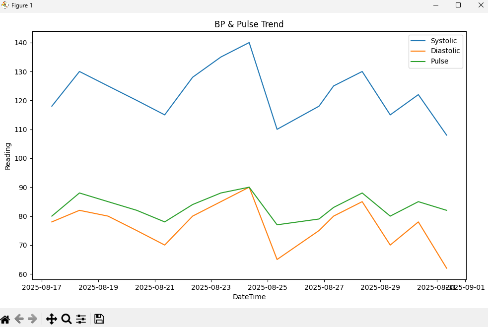

# Blood Pressure Tracker

This is a simple Python project to track, store, and analyze blood pressure and pulse readings over time.

## Features
- Add new blood pressure entries (systolic, diastolic, pulse) with date/time and notes.
- View all saved readings in a table format.
- Plot trends of blood pressure and pulse to visualize changes over time.
- Save data in CSV format for easy backup and editing.

## Installation

1. Make sure you have Python installed (Python 3.7 or later recommended).
2. Install required libraries:  

pip install pandas matplotlib openpyxl

## Usage

Run the main script:

Follow the prompts:
- Choose to add new reading, view data, or plot graphs.
- Enter blood pressure values and optional notes.
- View your data or see charts representing trends.

## Folder Structure

bp_tracker_project/
├── bp_data.csv # File storing all readings
├── bp_tracker.py # Main Python script
├── charts/ # Folder for saved chart images
└── README.md # Project documentation

## Notes

- Regularly take readings at the same time of day for best trend analysis.
- Consult your doctor if you see unusually high or low readings.
- Customize the script for additional features or data export.

---

Created for personal use to monitor and analyze blood pressure trends.
